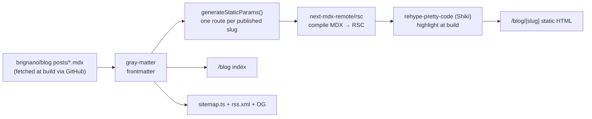
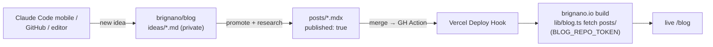
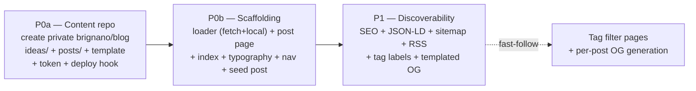

# TSD: brignano.io Blog (file-based MDX)

| | |
|---|---|
| **Status** | Draft — awaiting approval |
| **Author** | Anthony Brignano |
| **Date** | 2026-06-08 |
| **Repos** | `brignano.io` (app only) |
| **Target release** | v3.1 (additive — new `/blog` route) |
| **Related** | [tsd-site-modernization.md](./tsd-site-modernization.md) §9 (Work/case-studies — separate, content-heavy effort) |

---

## 1. Summary

Add a **writing section** to brignano.io at `/blog`, backed by **file-based MDX** living in a **separate private `brignano/blog` repo**. This is the highest-ROI *content* lever for long-term inbound reputation in platform engineering / DevEx / AI-native delivery — and the natural home for the topics already surfaced by the "Now Building" strip.

The blog repo holds two zones: an **`ideas/` catalog** (a low-friction backlog of post ideas with research notes that accrete over time — never built) and **`posts/`** (finished MDX, `published: true` — the only thing the site builds). The site is **100% build-time generated** to fit the existing `output: "export"` static deployment on Vercel: at build, `lib/blog.ts` fetches `posts/` from GitHub; a Vercel Deploy Hook rebuilds when a post is published. No CMS, no database, no runtime APIs, no monthly cost. Index, RSS, sitemap entries, OG, and structured data are all derived from the posts at build.

## 2. Background / problem statement

- The site currently has three routes (`/`, `/resume`, `/coding`) and **no place to publish writing**. The strongest proof of expertise is buried in `resume.yml`.
- A `projects` feature exists in `lib/constants.ts` but is empty; the site has no evolving, indexable content. Search reach and "authority" signal are static.
- The "Now Building" strip (§5.5b of the modernization TSD — homelab, local-LLM routing, Claude Code tooling) names ready-made post topics with no surface to expand them.
- **Hard constraint:** the site is a static export (`next.config.ts` → `output: "export"`, `images.unoptimized: true`). There is **no serverless runtime** — no ISR, no runtime route handlers, no on-request rendering. Any blog design must produce static HTML at build time.

## 3. Goals / non-goals

**Goals**
- A `/blog` index and `/blog/[slug]` post pages, authored as MDX in the separate `brignano/blog` repo.
- **Frictionless idea capture:** an `ideas/` catalog where a one-sentence idea becomes a file in seconds (incl. from **Claude Code mobile** against the repo), with research notes accreting over time before promotion to a post.
- Authoring is **git-native**: write/commit in `brignano/blog`; publishing triggers a site rebuild. No CMS UI.
- First-class technical reading: build-time syntax highlighting, readable typography, reading time, dates.
- MDX power: embed React components in a post when needed (charts, callouts, demos).
- No regressions to existing SEO, structured data, CSP, performance, or the static export build.
- Per-post SEO (metadata + `BlogPosting` JSON-LD) and auto-inclusion in sitemap + RSS.

**Non-goals (this TSD)**
- A CMS, database, or admin UI. Content is files.
- Comments, search, newsletter signup, view counters (all require a backend/SaaS — deferred).
- The `/work` case-studies section (separate TSD §9 of the modernization doc). A blog post ≠ a case study.
- Re-platforming off Vercel static export.

## 4. Audience & success criteria

| Audience | What they need | We win when… |
|---|---|---|
| Peers / dev community | Substantive, current technical writing | Posts render cleanly, are shareable, subscribable via RSS |
| Recruiters / hiring | Evidence of depth + communication | `/blog` reachable from nav; titles signal seniority |
| Search engines | Indexable, structured content | Posts in sitemap, valid `BlogPosting` schema, good Lighthouse |

**Measurable success**
- `next build` (static export) succeeds; every published post emits static HTML.
- Lighthouse on a post: Performance ≥ 95, Accessibility ≥ 100, SEO 100.
- Zero client-side syntax-highlighter JS shipped (highlighting baked at build).
- New posts appear in `/blog`, `sitemap.xml`, and `rss.xml` with **no manual registration** — publish the file, deploy hook fires, done.
- Drafts (`published: false`) and everything in `ideas/` never ship to production output.
- An idea can be captured as a new `ideas/*.md` file from a phone (Claude Code mobile / GitHub) in under a minute, with no effect on the live site.

## 5. Proposed design

### 5.1 Content model

Content lives in the **`brignano/blog`** repo (private), structured as:

```
brignano/blog/
├── posts/<slug>.mdx     # finished, publishable — the ONLY thing the site builds
└── ideas/<slug>.md      # catalog/backlog — never built (see §5.7)
```

Slug = filename. Published posts live in `posts/`; the build fetches that directory and ignores everything else.

**Post frontmatter schema** (validated at build; build fails loudly on malformed frontmatter):

```yaml
---
title: "One build command, any stack"      # required
description: "Why context-aware builds..."  # required — used for <meta> + index excerpt
date: 2026-06-15                             # required — ISO; drives ordering + display
updated: 2026-06-20                          # optional
tags: ["platform-engineering", "ci-cd"]      # optional — rendered as labels (no filter pages in v1)
published: true                              # required — false = draft, excluded in prod
---
```

A typed loader in **`lib/blog.ts`** is the single source of truth **and the content-source abstraction** (see §5.6):
- `getAllPosts()` — read source, parse frontmatter (`gray-matter`), filter `published` in production, sort by `date` desc.
- `getPostBySlug(slug)` — frontmatter + raw MDX body.
- Derived per post: `readingTime` (`reading-time` pkg), formatted date, absolute URL.
- A `Post` type in `types/blog.ts` mirrors the frontmatter (parallels `types/resume.ts`).
- **Pages, sitemap, RSS, and OG only ever call these two functions** — never the filesystem directly. This is what makes the content *source* swappable later (§5.6) with no churn to anything downstream.

### 5.2 Rendering pipeline (all build-time)



- **MDX → RSC:** `next-mdx-remote/rsc` (compiles in a Server Component; no client runtime). Mapped MDX components (custom `<Callout>`, styled `<a>`, `next/image` wrapper) defined once and passed in.
- **Syntax highlighting:** `rehype-pretty-code` (Shiki) with a light + dark theme matching the site. Runs at build → highlighted markup is static; **no highlighter JS in the bundle.**
- **Typography:** `@tailwindcss/typography` `prose` classes, tuned for dark mode and the new accent hue (modernization TSD §10.3). Wrap post body in `prose dark:prose-invert`.

### 5.3 Routes & UI

| Route | Source | Notes |
|---|---|---|
| `/blog` | `app/blog/page.tsx` | Index: list of post cards (title, date, reading time, description, tag labels), newest first. Reuses `ScrollReveal`, existing card styling. |
| `/blog/[slug]` | `app/blog/[slug]/page.tsx` | `generateStaticParams` from `getAllPosts()`. Post header (title, date, reading time, tags) + `prose` body + footer back-link. |

- **Nav:** add a link (label TBD §10) to `components/header.tsx` (desktop + mobile) and optionally `footer.tsx`.
- **Tags:** rendered as **non-interactive labels** in v1 (reuse `SkillBadge` styling). Dedicated `/blog/tag/[tag]` filter pages are a **fast-follow** — empty filter pages with <10 posts hurt UX more than help.
- **Empty/edge states:** `/blog` with zero published posts renders a graceful "Writing soon" state, not a blank list.

### 5.4 SEO, RSS, sitemap

- **Per-post metadata:** `generateMetadata()` per slug → title, description, canonical, OG/Twitter (mirrors `layout.tsx` pattern).
- **Structured data:** `BlogPosting` JSON-LD per post (reuse the JSON-LD approach in `layout.tsx`); `Blog`/breadcrumb on the index (reuse `BreadcrumbSchema`).
- **Sitemap:** rework `app/sitemap.ts` (currently 3 hardcoded URLs) to append all published posts from `getAllPosts()` with `lastModified` from `updated ?? date`.
- **RSS:** generated at build via a **static route handler** `app/rss.xml/route.ts` with `export const dynamic = "force-static"` (supported under `output: export`). Feed built from `getAllPosts()`. *(Fallback if the static route handler misbehaves under export: a `postbuild` node script that writes `out/rss.xml`. Decided in P1 against a real build.)*
- **OG images:** v1 ships a **templated static default** (site branding + "Writing" — reuse/adapt `public/og.webp`). **Fast-follow:** per-post images via `app/blog/[slug]/opengraph-image.tsx` using `next/og` `ImageResponse` (these *are* generated at build time during static export).

### 5.5 Authoring workflow

1. In `brignano/blog`, create `posts/my-post.mdx` with frontmatter + body (or promote an idea — §5.7).
2. Preview: site dev server reads from a local clone of `brignano/blog` (env-configurable path) so `/blog/my-post` renders locally before publish.
3. Set `published: true` and merge → a GitHub Action in `brignano/blog` fires the **Vercel Deploy Hook** → site rebuilds and the post goes live. No step in the app repo.
4. `published: false` keeps it previewable locally but out of production output, sitemap, and RSS.

### 5.6 Content source: separate private `brignano/blog` repo

**Key constraint:** the site is a static export, so the app **must rebuild to publish** regardless of where posts live. Externalizing does *not* enable runtime publishing — it moves *authoring* into a dedicated repo and adds a rebuild trigger. The justification (decided §9) is the **idea catalog (§5.7)**: a backlog of half-baked ideas + accreting research belongs in content space, not the app codebase.

**`lib/blog.ts` is the content-source interface.** Pages, sitemap, RSS, and OG call only `getAllPosts()` / `getPostBySlug()`; only the loader knows content comes from `brignano/blog`. This keeps the source swappable (back to in-repo, or to a CMS) as a one-file change.

**Repo visibility:** **private** — the raw idea backlog must not be public. Consequence: the build needs read auth.

**Build-time fetch.** At build, `lib/blog.ts` reads `posts/` from `brignano/blog` via the GitHub API (or a shallow sparse clone of `posts/`), authenticated by a **fine-grained PAT or GitHub App token** (read-only, `posts`-scoped where possible) stored as a **Vercel env var** (e.g. `BLOG_REPO_TOKEN`). The catalog (`ideas/`) is never fetched.

**Publish trigger.** A GitHub Action in `brignano/blog` fires a **Vercel Deploy Hook** on merge to its default branch, so publishing a post rebuilds the site automatically. The hook URL is the Action's only secret.

**Local preview.** `lib/blog.ts` reads from a local clone path (e.g. `BLOG_CONTENT_DIR`) when set, falling back to the GitHub fetch — so `npm run dev` previews against a checked-out `brignano/blog` with no token needed.



> **Submodule alternative — rejected.** A git submodule (`content/blog` → `brignano/blog`) needs a pointer-bump commit in the app repo per publish, which undercuts the "easier to manage" goal. Build-time fetch keeps the two repos fully decoupled.

### 5.7 Idea catalog (`ideas/`)

The catalog is the backlog that lets ideas be captured the moment they occur — without research up front — and fleshed out later.

- **Format:** one `ideas/<slug>.md` per idea. Frontmatter is **minimal and all-optional** (`title`, optional `tags`, optional `status: idea | researching | drafting`). No required fields — capture must never be blocked by ceremony. Body is free-form: a sentence to start, then links/outline/research notes accrete over time.
- **Never built.** The site fetches only `posts/`; `ideas/` has zero effect on the live site, so the backlog can be as rough and large as wanted.
- **Capture from anywhere:** create `ideas/<slug>.md` via **Claude Code mobile** (say a sentence → it scaffolds the file from the template, and can optionally pre-stage research), GitHub mobile, or any editor. Under a minute, no laptop.
- **Promotion:** when an idea is ready, it graduates from `ideas/<slug>.md` to `posts/<slug>.mdx` — add full post frontmatter, write the body, set `published: true`. (Keep or delete the idea file; promotion is a copy+flesh-out, not an automated move.)
- **Idea template** (committed as `ideas/_TEMPLATE.md` in `brignano/blog`):

```markdown
---
title: ""
tags: []
status: idea   # idea | researching | drafting
---

## The idea
<one sentence>

## Why it's worth writing
<who cares, what's the hook>

## Research / notes
- <links, facts, prior art — accrete over time>

## Outline
- <bullets when ready to draft>
```

## 6. Phasing



| Phase | Scope | Risk | Reviewable as |
|---|---|---|---|
| **P0a** | §5.6 setup | Low | `brignano/blog` repo created (ideas/ + posts/ + `_TEMPLATE.md`), `BLOG_REPO_TOKEN` + deploy hook wired |
| **P0b** | §5.1, §5.2, §5.3 | Med | 1 PR — `/blog` + one real post (fetched from `brignano/blog`) renders, styled, in nav |
| **P1** | §5.4 | Low | 1 PR — SEO, sitemap, RSS, OG default |
| **Fast-follow** | tag pages, per-post OG | Low | Separate PRs once post count justifies |

Each phase is independently shippable; P0 (a+b) alone is a usable blog with a working catalog.

## 7. Risks & mitigations

| Risk | Mitigation |
|---|---|
| `next-mdx-remote/rsc` compatibility with Next 16 / React 19 | Verify versions before building; fallbacks: `@next/mdx` (file-routed) or `velite`/`content-collections` (typed content layer). Decision locked in P0 spike. |
| Static-export incompatibility (RSS route, OG) | RSS via `force-static` route handler — confirm in real `next build`; documented `postbuild` script fallback. OG via build-time `opengraph-image`. |
| `@tailwindcss/typography` + Tailwind v4 setup | Register via `@plugin "@tailwindcss/typography"` in `globals.css`; verify `prose` + `dark:prose-invert` render. |
| Bundle/CSS growth on `/coding` or home | Blog deps are dynamically scoped to blog routes; assert `/coding` + `/` bundle sizes unchanged. |
| Shiki theme weight | Highlighting is build-time only — zero client cost by construction. |
| Malformed frontmatter ships silently | Loader validates required fields and **fails the build** on error. |
| Build-time GitHub fetch fails / rate-limited / repo unavailable | Authenticated requests (5k/hr is ample); loader caches the fetch within a build; on fetch failure the build **fails loudly** rather than shipping an empty `/blog`. Local dev uses `BLOG_CONTENT_DIR`, no network. |
| `BLOG_REPO_TOKEN` leak or expiry | Fine-grained, **read-only**, single-repo scope; stored only as a Vercel env var; calendar reminder for expiry. Token only reads already-private content, blast radius is low. |
| Private idea backlog accidentally exposed | Build fetches **`posts/` only**; `ideas/` is never requested. Repo stays private regardless. |
| Two repos to keep in sync mentally | Publishing is one-repo (`brignano/blog`); the app repo never changes per post. Deploy hook removes the manual rebuild step. |
| Content cadence stalls | Out of engineering scope; seed with 1–2 posts from "Now Building" topics so launch isn't empty. |

## 8. Verification plan

- `next build` (static export) succeeds; `out/blog/<slug>/index.html` exists per published post; drafts absent.
- Local preview `/blog` + a post at desktop + mobile, light + dark: typography, code highlighting (both themes), reading time, dates.
- `prefers-reduced-motion` respected (reuse `ScrollReveal` contract).
- `out/sitemap.xml` includes published posts; `out/rss.xml` validates (W3C feed validator).
- View-source a post: `BlogPosting` JSON-LD present and valid; OG/Twitter tags correct.
- Lighthouse on a post meets §4 targets; confirm no syntax-highlighter JS in the client bundle.
- Nav link works desktop + mobile; `/blog` empty-state path checked.
- **Content source:** build fetches `posts/` from `brignano/blog` with `BLOG_REPO_TOKEN`; confirm a post added there appears after a deploy-hook-triggered build. Confirm `ideas/` content never reaches `out/`. Confirm `npm run dev` works against a local clone via `BLOG_CONTENT_DIR` with no token. Confirm a fetch failure fails the build (no silent empty `/blog`).
- **Catalog:** creating `ideas/x.md` from Claude Code mobile produces a valid file from the template and does **not** trigger or change a site build.

## 9. Decisions

1. **Format:** ✅ **MDX** (embeddable React components), not plain Markdown. §5.2
2. **v1 scope:** ✅ **Posts + index + RSS + tag *labels* + templated OG.** Tag *filter pages* and *per-post* OG generation are **fast-follows** (§6) — best UX-per-effort given low initial post count.
3. **Content source:** ✅ **Separate private `brignano/blog` repo** with an `ideas/` catalog (never built) + `posts/` (built). Build-time fetch of `posts/` via GitHub using a read-only `BLOG_REPO_TOKEN`; publish triggered by a Vercel Deploy Hook from a GitHub Action. `lib/blog.ts` is the swappable content-source interface. §5.6 — *justified by the idea-catalog workflow, not deferred.*
4. **Capture:** ✅ **Markdown files in `ideas/`** (one per idea, minimal optional frontmatter), created from **Claude Code mobile** / GitHub / any editor; research accretes in-file. §5.7
5. **Visibility:** ✅ **Private repo** — raw backlog stays hidden; build authenticates to fetch `posts/`.
6. **Proceed:** ✅ **TSD-first** (this doc), then implement on `feat/blog` after approval.

### Open questions (resolve before/at P0)
- **Nav label + URL:** `/blog` (label "Blog") vs `/writing` ("Writing") vs `/notes` ("Notes"). Affects route folder + sitemap.
- **MDX library:** confirm `next-mdx-remote/rsc` vs `velite`/`content-collections` after a 30-min P0 spike against Next 16 (must compose with the build-time GitHub fetch).
- **Token mechanism:** fine-grained PAT (simplest) vs GitHub App (no expiry, more setup) for `BLOG_REPO_TOKEN`. Default to fine-grained PAT for v1.
- **Seed posts:** which 1–2 "Now Building" topics launch first (homelab, local-LLM routing, or Claude Code tooling)?

---

*Approval = sign-off on §3 goals, §5 design, and §9 decisions. P0 can proceed on approval; open questions above are P0-blocking only where noted.*
