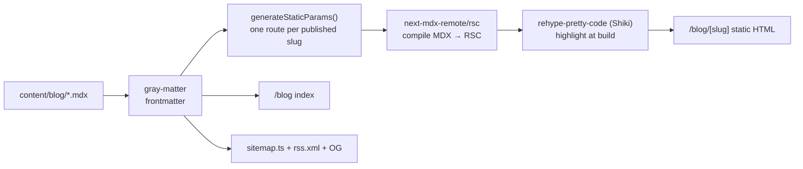
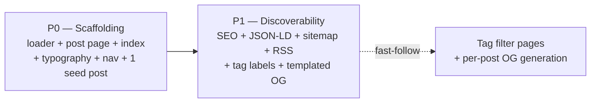

# TSD: brignano.io Blog (file-based MDX)

| | |
|---|---|
| **Status** | Draft — awaiting approval |
| **Author** | Anthony Brignano |
| **Date** | 2026-06-08 |
| **Repos** | `brignano.io` (app only) |
| **Target release** | v3.1 (additive — new `/blog` route) |
| **Related** | [tsd-site-modernization.md](./tsd-site-modernization.md) §9 (Work/case-studies — separate, content-heavy effort) |

---

## 1. Summary

Add a **writing section** to brignano.io at `/blog`, backed by **file-based MDX** committed to the repo. This is the highest-ROI *content* lever for long-term inbound reputation in platform engineering / DevEx / AI-native delivery — and the natural home for the topics already surfaced by the "Now Building" strip.

The blog is **100% build-time generated** to fit the existing `output: "export"` static deployment on Vercel. No CMS, no database, no runtime APIs, no monthly cost. Posts are MDX files; everything else (index, RSS, sitemap entries, OG, structured data) is derived from them at build.

## 2. Background / problem statement

- The site currently has three routes (`/`, `/resume`, `/coding`) and **no place to publish writing**. The strongest proof of expertise is buried in `resume.yml`.
- A `projects` feature exists in `lib/constants.ts` but is empty; the site has no evolving, indexable content. Search reach and "authority" signal are static.
- The "Now Building" strip (§5.5b of the modernization TSD — homelab, local-LLM routing, Claude Code tooling) names ready-made post topics with no surface to expand them.
- **Hard constraint:** the site is a static export (`next.config.ts` → `output: "export"`, `images.unoptimized: true`). There is **no serverless runtime** — no ISR, no runtime route handlers, no on-request rendering. Any blog design must produce static HTML at build time.

## 3. Goals / non-goals

**Goals**
- A `/blog` index and `/blog/[slug]` post pages, authored as MDX in the repo.
- Authoring is **git-native**: write a `.mdx` file, commit, deploy. No external tooling.
- First-class technical reading: build-time syntax highlighting, readable typography, reading time, dates.
- MDX power: embed React components in a post when needed (charts, callouts, demos).
- No regressions to existing SEO, structured data, CSP, performance, or the static export build.
- Per-post SEO (metadata + `BlogPosting` JSON-LD) and auto-inclusion in sitemap + RSS.

**Non-goals (this TSD)**
- A CMS, database, or admin UI. Content is files.
- Comments, search, newsletter signup, view counters (all require a backend/SaaS — deferred).
- The `/work` case-studies section (separate TSD §9 of the modernization doc). A blog post ≠ a case study.
- Re-platforming off Vercel static export.

## 4. Audience & success criteria

| Audience | What they need | We win when… |
|---|---|---|
| Peers / dev community | Substantive, current technical writing | Posts render cleanly, are shareable, subscribable via RSS |
| Recruiters / hiring | Evidence of depth + communication | `/blog` reachable from nav; titles signal seniority |
| Search engines | Indexable, structured content | Posts in sitemap, valid `BlogPosting` schema, good Lighthouse |

**Measurable success**
- `next build` (static export) succeeds; every published post emits static HTML.
- Lighthouse on a post: Performance ≥ 95, Accessibility ≥ 100, SEO 100.
- Zero client-side syntax-highlighter JS shipped (highlighting baked at build).
- New posts appear in `/blog`, `sitemap.xml`, and `rss.xml` with **no manual registration** — drop the file, done.
- Drafts (`published: false`) never ship to production output.

## 5. Proposed design

### 5.1 Content model

Posts live in **`content/blog/<slug>.mdx`** (outside `app/`, so files aren't accidental routes). Slug = filename.

**Frontmatter schema** (validated at build; build fails loudly on malformed frontmatter):

```yaml
---
title: "One build command, any stack"      # required
description: "Why context-aware builds..."  # required — used for <meta> + index excerpt
date: 2026-06-15                             # required — ISO; drives ordering + display
updated: 2026-06-20                          # optional
tags: ["platform-engineering", "ci-cd"]      # optional — rendered as labels (no filter pages in v1)
published: true                              # required — false = draft, excluded in prod
---
```

A typed loader in **`lib/blog.ts`** is the single source of truth **and the content-source abstraction** (see §5.6):
- `getAllPosts()` — read source, parse frontmatter (`gray-matter`), filter `published` in production, sort by `date` desc.
- `getPostBySlug(slug)` — frontmatter + raw MDX body.
- Derived per post: `readingTime` (`reading-time` pkg), formatted date, absolute URL.
- A `Post` type in `types/blog.ts` mirrors the frontmatter (parallels `types/resume.ts`).
- **Pages, sitemap, RSS, and OG only ever call these two functions** — never the filesystem directly. This is what makes the content *source* swappable later (§5.6) with no churn to anything downstream.

### 5.2 Rendering pipeline (all build-time)



- **MDX → RSC:** `next-mdx-remote/rsc` (compiles in a Server Component; no client runtime). Mapped MDX components (custom `<Callout>`, styled `<a>`, `next/image` wrapper) defined once and passed in.
- **Syntax highlighting:** `rehype-pretty-code` (Shiki) with a light + dark theme matching the site. Runs at build → highlighted markup is static; **no highlighter JS in the bundle.**
- **Typography:** `@tailwindcss/typography` `prose` classes, tuned for dark mode and the new accent hue (modernization TSD §10.3). Wrap post body in `prose dark:prose-invert`.

### 5.3 Routes & UI

| Route | Source | Notes |
|---|---|---|
| `/blog` | `app/blog/page.tsx` | Index: list of post cards (title, date, reading time, description, tag labels), newest first. Reuses `ScrollReveal`, existing card styling. |
| `/blog/[slug]` | `app/blog/[slug]/page.tsx` | `generateStaticParams` from `getAllPosts()`. Post header (title, date, reading time, tags) + `prose` body + footer back-link. |

- **Nav:** add a link (label TBD §10) to `components/header.tsx` (desktop + mobile) and optionally `footer.tsx`.
- **Tags:** rendered as **non-interactive labels** in v1 (reuse `SkillBadge` styling). Dedicated `/blog/tag/[tag]` filter pages are a **fast-follow** — empty filter pages with <10 posts hurt UX more than help.
- **Empty/edge states:** `/blog` with zero published posts renders a graceful "Writing soon" state, not a blank list.

### 5.4 SEO, RSS, sitemap

- **Per-post metadata:** `generateMetadata()` per slug → title, description, canonical, OG/Twitter (mirrors `layout.tsx` pattern).
- **Structured data:** `BlogPosting` JSON-LD per post (reuse the JSON-LD approach in `layout.tsx`); `Blog`/breadcrumb on the index (reuse `BreadcrumbSchema`).
- **Sitemap:** rework `app/sitemap.ts` (currently 3 hardcoded URLs) to append all published posts from `getAllPosts()` with `lastModified` from `updated ?? date`.
- **RSS:** generated at build via a **static route handler** `app/rss.xml/route.ts` with `export const dynamic = "force-static"` (supported under `output: export`). Feed built from `getAllPosts()`. *(Fallback if the static route handler misbehaves under export: a `postbuild` node script that writes `out/rss.xml`. Decided in P1 against a real build.)*
- **OG images:** v1 ships a **templated static default** (site branding + "Writing" — reuse/adapt `public/og.webp`). **Fast-follow:** per-post images via `app/blog/[slug]/opengraph-image.tsx` using `next/og` `ImageResponse` (these *are* generated at build time during static export).

### 5.5 Authoring workflow

1. Create `content/blog/my-post.mdx` with frontmatter + body.
2. `npm run dev` — live preview at `/blog/my-post`.
3. Commit + push → Vercel builds the static post. No registration step anywhere.
4. `published: false` keeps it previewable locally but out of production output, sitemap, and RSS.

### 5.6 Content source: in-repo now, externalizable later

**Key constraint:** the site is a static export, so the app **must rebuild to publish** regardless of where posts live. "Externalizing" content does *not* enable runtime publishing — it only moves *authoring* to a second repo and adds a rebuild trigger.

**Decision (§9): start in-repo (`content/blog/*.mdx`), but design `lib/blog.ts` as a content-source interface** so the source can change without touching pages, sitemap, RSS, or OG. Only `getAllPosts()` / `getPostBySlug()` know *where* content comes from.

If/when externalizing to a `brignano/blog` repo is justified (writing from other tooling/devices, automation or a second author publishing, or fully separate content history), the recipe is:

| Option | Publish flow | Notes |
|---|---|---|
| **Build-time fetch** *(preferred if externalizing)* | Push to `brignano/blog` → GitHub Action in that repo fires a **Vercel Deploy Hook** → app build pulls MDX via GitHub API/raw into the loader | Cleanest separation; adds a build-time GitHub dependency + one deploy-hook secret. Swap is isolated to `lib/blog.ts`. |
| **Git submodule** (`content/blog` → `brignano/blog`) | Push to blog repo, then bump submodule pointer in app repo | Rejected as default — submodule UX is painful and the pointer-bump commit undercuts the "easier to manage" goal. |

**Verdict for v1:** in-repo. Externalizing at 0 posts is premature complexity (second repo + deploy hook + build-time network dependency) for no current benefit. The interface above keeps the escape hatch cheap.

## 6. Phasing



| Phase | Scope | Risk | Reviewable as |
|---|---|---|---|
| **P0** | §5.1, §5.2, §5.3 | Med | 1 PR — `/blog` + one real post renders, styled, in nav |
| **P1** | §5.4 | Low | 1 PR — SEO, sitemap, RSS, OG default |
| **Fast-follow** | tag pages, per-post OG | Low | Separate PRs once post count justifies |

Each phase is independently shippable; P0 alone is a usable blog.

## 7. Risks & mitigations

| Risk | Mitigation |
|---|---|
| `next-mdx-remote/rsc` compatibility with Next 16 / React 19 | Verify versions before building; fallbacks: `@next/mdx` (file-routed) or `velite`/`content-collections` (typed content layer). Decision locked in P0 spike. |
| Static-export incompatibility (RSS route, OG) | RSS via `force-static` route handler — confirm in real `next build`; documented `postbuild` script fallback. OG via build-time `opengraph-image`. |
| `@tailwindcss/typography` + Tailwind v4 setup | Register via `@plugin "@tailwindcss/typography"` in `globals.css`; verify `prose` + `dark:prose-invert` render. |
| Bundle/CSS growth on `/coding` or home | Blog deps are dynamically scoped to blog routes; assert `/coding` + `/` bundle sizes unchanged. |
| Shiki theme weight | Highlighting is build-time only — zero client cost by construction. |
| Malformed frontmatter ships silently | Loader validates required fields and **fails the build** on error. |
| Content cadence stalls | Out of engineering scope; seed with 1–2 posts from "Now Building" topics so launch isn't empty. |

## 8. Verification plan

- `next build` (static export) succeeds; `out/blog/<slug>/index.html` exists per published post; drafts absent.
- Local preview `/blog` + a post at desktop + mobile, light + dark: typography, code highlighting (both themes), reading time, dates.
- `prefers-reduced-motion` respected (reuse `ScrollReveal` contract).
- `out/sitemap.xml` includes published posts; `out/rss.xml` validates (W3C feed validator).
- View-source a post: `BlogPosting` JSON-LD present and valid; OG/Twitter tags correct.
- Lighthouse on a post meets §4 targets; confirm no syntax-highlighter JS in the client bundle.
- Nav link works desktop + mobile; `/blog` empty-state path checked.

## 9. Decisions

1. **Content source:** ✅ **File-based MDX in-repo** (`content/blog/*.mdx`). No CMS — fits static export, zero cost, git-native, matches "self-hosted/simple/low-maintenance" defaults.
2. **Format:** ✅ **MDX** (embeddable React components), not plain Markdown. §5.2
3. **v1 scope:** ✅ **Posts + index + RSS + tag *labels* + templated OG.** Tag *filter pages* and *per-post* OG generation are **fast-follows** (§6) — best UX-per-effort given low initial post count.
4. **Content source:** ✅ **In-repo for v1**, with `lib/blog.ts` built as a swappable content-source interface. Externalizing to a `brignano/blog` repo is documented (§5.6, build-time fetch + Vercel Deploy Hook) but deferred — premature at 0 posts, and the interface makes a later swap a one-file change.
5. **Proceed:** ✅ **TSD-first** (this doc), then implement on `feat/blog` after approval.

### Open questions (resolve before/at P0)
- **Nav label + URL:** `/blog` (label "Blog") vs `/writing` ("Writing") vs `/notes` ("Notes"). Affects route folder + sitemap.
- **MDX library:** confirm `next-mdx-remote/rsc` vs `velite`/`content-collections` after a 30-min P0 spike against Next 16.
- **Seed posts:** which 1–2 "Now Building" topics launch first (homelab, local-LLM routing, or Claude Code tooling)?

---

*Approval = sign-off on §3 goals, §5 design, and §9 decisions. P0 can proceed on approval; open questions above are P0-blocking only where noted.*
