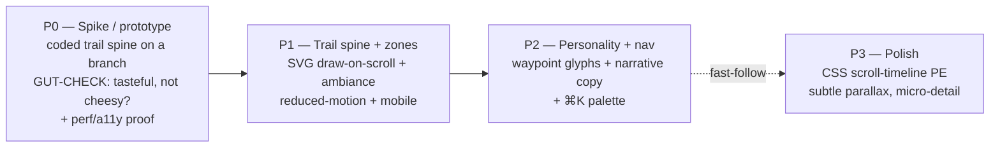

# TSD: brignano.io Signature Homepage Experience ("The Trail")

| | |
|---|---|
| **Status** | Draft — awaiting approval |
| **Author** | Anthony Brignano |
| **Date** | 2026-06-08 |
| **Repos** | `brignano.io` (app only) |
| **Target release** | v4.0 (signature experience) |
| **Related** | [tsd-site-modernization.md](./tsd-site-modernization.md) (evolves §10.2 motif, reuses §10.3 accent, builds on §5.1 animation system) · [tsd-blog.md](./tsd-blog.md) |

---

## 1. Summary

Give the homepage **one memorable signature interaction** that makes the site unmistakably *Anthony* — without sacrificing the speed, accessibility, or senior/professional read the site depends on. A single continuous **trail / ridgeline** threads vertically through the homepage and **draws itself as the user scrolls**, passing through three ambient altitude zones mapped to the outdoor-life progression — **hiking → snowboarding → climbing** — which doubles as a quiet metaphor for the career arc (foundations → momentum → summit / what's next).

The through-line is the **unifying theme** that ties the two halves of the identity together: the platform work is already framed as *"paved roads for engineers"* (modernization §5.5b); the personal life is literally *trails*. The site's metaphor becomes **the climb** — and nobody else has *this* trail. Uniqueness comes from the authentic narrative, not from rendering tech.

Built with **SVG + CSS + a small scroll-progress hook — no WebGL, no scroll-jacking, no heavy dependencies** — so it fits the static export, stays within the Lighthouse budget, and degrades to a clean static page under `prefers-reduced-motion`.

## 2. Background / problem statement

The current homepage is solid but **reads as a conventional portfolio template**: a traditional top nav and a sequence of well-built but static sections with no through-line or moment of delight. There is nothing that makes a visitor remember *this* site specifically, and nothing that surfaces the personality (outdoors, range, taste) behind the résumé. The goal is to reach the tier of personal sites that get cited as exemplary — **distinctive and custom, not template-driven** — while staying appropriate for an audience that includes recruiters and CIO/CTO/CEO.

**Constraints inherited (non-negotiable):**
- Static export (`output: "export"`), Vercel, Next 16 / React 19, Tailwind v4.
- Lighthouse targets from modernization §4: **Performance ≥ 95, Accessibility 100**, no contrast failures.
- Existing animation contract (modernization §5.1): content is **visible by default**; motion is progressive enhancement; `prefers-reduced-motion` renders the final state with no transforms.
- Low maintenance burden (personal site, self-maintained).

## 3. Goals / non-goals

**Goals**
- One **signature, memorable** homepage interaction that is authentically personal.
- Surface life outside coding (hiking/snowboarding/climbing) as an **ambient journey**, with professional content kept as the substance.
- Modernize the *feel* of navigation away from a generic top bar (§5.6) without losing obvious wayfinding.
- Preserve all current SEO, structured data, CSP, content, and the Lighthouse budget.
- Fully usable and coherent **without** the visual layer (content-first; motion is enhancement).

**Non-goals (this TSD)**
- **Scroll-jacking / scroll hijacking** of any kind. Native scroll only — the trail responds to scroll, never controls it.
- WebGL / 3D / heavy animation libraries as the primary mechanism (Direction C — explicitly rejected as style-over-substance for this audience).
- Re-architecting content/IA, the blog, `/resume`, or `/coding` (separate efforts).
- A redesign of the visual identity beyond evolving the already-decided motif + accent.

## 4. Audience & success criteria

| Audience | What they need | We win when… |
|---|---|---|
| Peers / hiring engineers | Evidence of taste + craft | The interaction reads as "tasteful and well-built," not gimmicky |
| Recruiters | Fast credibility, easy wayfinding | Obvious nav + content still scannable in seconds |
| CIO/CTO/CEO | Senior signal, no flash-over-substance | Calm, fast, professional; the personality reads as confidence |
| Returning peers / "portfolio roundups" | A reason to remember + share | The trail is distinctive enough to be the thing people mention |

**Measurable success**
- Lighthouse (mobile + desktop): **Performance ≥ 95, Accessibility 100**; CLS ≈ 0 from the trail layer.
- `prefers-reduced-motion`: trail renders **static and complete**, zero scroll-linked motion, all content visible.
- No scroll-jank: trail updates stay on the compositor (transform/opacity only); main thread not blocked on scroll.
- Works at 375×812 (mobile) — the signature is *felt*, not broken or hidden.
- Net added JS for the experience is **small** (target: no heavy animation dep; vanilla hook + CSS).
- The page is fully understandable with the SVG layer removed (content-first check).

## 5. Proposed design

### 5.1 Concept & narrative mapping

A single **persistent trail layer** sits behind the homepage content as a vertical spine (edge-anchored on desktop, simplified on mobile). As the user scrolls top → bottom, the trail **draws** from trailhead to summit, and the ambient backdrop shifts through three zones. **Professional content is foregrounded as the substance; the outdoor zones are the connective tissue and personality**, not a literal "my career is a mountain" billboard.

| Scroll zone | Outdoor | Career sub-text | Maps to existing section(s) |
|---|---|---|---|
| **Base — forest** | Hiking | Foundations / who I am | Hero (trailhead) → About |
| **Mid — slopes** | Snowboarding | Momentum / the platform work | Highlights → Current Role |
| **Summit — ridge** | Climbing | Current / what's next | Open-source activity → Contact ("Let's build something" = the peak) |

No section reordering is required — the existing top-to-bottom order already reads base → summit. Hero is the trailhead; the final CTA is the summit payoff.

### 5.2 Visual language

- **The trail line:** a restrained, line-art path — a stylized **topographic ridgeline / contour** rather than a literal cartoon mountain. This *evolves* the "paved road" motif decided in modernization §10.2 into a "trail" (same idea, richer story). Concentrated and deliberate — the site's signature, like the Silkscreen accent: used once, well.
- **Zone ambiance:** subtle, low-contrast backdrop hue shift between zones (cool forest → slope blue → **summit indigo/violet**, paying off the accent decided in modernization §10.3). Shifts must stay subtle enough to preserve WCAG AA text contrast in both themes.
- **Waypoints (Phase 2):** at each zone boundary, a small line-art glyph (hiker / snowboarder / climber) reveals as the trail passes — the only illustration on the site, kept minimal and on-theme. Decorative (`aria-hidden`).
- **Restraint rule:** if a flourish doesn't serve the trail metaphor or reveal personality, it's cut. One signature, not ten effects.

### 5.3 Technical approach

- **Trail = inline SVG path** in a fixed/sticky decorative layer behind content. Tiny payload; crisp at any DPI; theme-able via `currentColor`/CSS vars.
- **Draw on scroll = `stroke-dasharray` + `stroke-dashoffset`** driven by a scroll-progress value (0→1). Baseline mechanism: a small `useScrollProgress` hook (scroll listener throttled with `requestAnimationFrame`) writing a CSS custom property `--trail-progress`; the SVG offset and zone backdrops read that variable. **Compositor-only** properties (transform/opacity/stroke-dashoffset) — no layout thrash.
- **Progressive enhancement:** where supported, use **CSS scroll-driven animations** (`animation-timeline: scroll()`) so the draw runs off the main thread with *zero* JS; fall back to the rAF hook elsewhere. (Browser support is uneven as of this writing — the JS hook is the reliable baseline; CSS scroll-timeline is a later enhancement, not a dependency.)
- **No WebGL, no GSAP/ScrollMagic.** Evaluate whether even a motion lib (e.g. `motion`/Framer) is warranted — **default to vanilla + CSS** to protect the bundle and stay consistent with the custom `ScrollReveal` (which already replaced AOS). Any dep must justify its bundle cost in the P0 spike.
- **Static-export safe:** everything renders at build; the trail is a client component that enhances already-present, server-rendered content.

### 5.4 Accessibility & motion (content-first)

- **`prefers-reduced-motion: reduce` → trail renders fully drawn and static**, no scroll-linked drawing, no parallax, no zone transitions beyond a static backdrop. Mirrors the modernization §5.1 contract.
- The trail layer is **decorative**: `aria-hidden="true"` / `role="presentation"`. The narrative is conveyed by real text content; **removing the SVG must not remove meaning**.
- **No scroll-jacking, no scroll snapping that traps the user.** Native scroll velocity preserved; keyboard scroll, Page Down, and screen-reader virtual cursor all behave normally.
- Focus order and tab navigation unaffected by the decorative layer.
- Maintain AA contrast across all zone backdrops, light and dark.

### 5.5 Mobile strategy

- The trail **simplifies, it does not disappear**: thinner spine anchored to one edge (or centered), reduced waypoint detail, zone ambiance retained.
- No effect may push the hero's primary CTA below the fold at 375×812 (modernization §4 carry-over).
- Scroll performance verified on a mid-tier device profile; if the rAF hook ever costs frames on mobile, the trail falls back to a static drawn state there.

### 5.6 Navigation refresh (addresses the "traditional topnav" gripe)

Keep obvious wayfinding (recruiters/execs/a11y need it) but make nav part of the signature rather than a generic bar:

- **Refine, don't remove, the header:** minimal, sticky, quiet.
- **Trail-anchored progress + section markers:** the trail doubles as a scroll-progress indicator; waypoints are clickable to jump to sections — nav *is* the trail.
- **⌘K command palette (peer-craft signal):** fast keyboard navigation + actions (résumé, coding, blog, contact, theme). Reuse `@headlessui/react` (already a dep) for an accessible dialog; no new heavy dep. Strong "modern senior dev" signal that costs little.

### 5.7 Relationship to the modernization TSD

This **evolves**, not contradicts, the prior decisions:
- §10.2 "restrained paved-road motif" → becomes the **trail through-line** (same restraint principle, fuller narrative).
- §10.3 electric indigo/violet accent → becomes the **summit color**, giving the accent a narrative reason to exist.
- §5.1 animation contract (visible-by-default, reduced-motion-safe) → **reused verbatim** as the foundation.

## 6. Phasing

| Phase | Scope | Risk | Gate |
|---|---|---|---|
| **P0** | §5.3 spike, taste gate | High (taste) | **A real coded prototype to look at and approve before committing.** Kill/redirect here if it reads gimmicky. |
| **P1** | §5.1–5.5 core | Med | Trail draws, zones shift, passes Lighthouse + reduced-motion + mobile |
| **P2** | §5.2 waypoints, §5.6 nav | Low | Personality + nav refresh shipped |
| **P3** | §5.3 PE, polish | Low | Optional enhancements once core is proven |

**P0 is a hard gate.** This design lives or dies on taste, which cannot be specified — only seen. Build a throwaway prototype, look at it on real devices, and only proceed if it clears the "tasteful, unmistakably me, not cheesy" bar.

## 7. Risks & mitigations

| Risk | Mitigation |
|---|---|
| **Metaphor reads as cheesy / forced** | P0 taste gate with a real prototype; keep professional content as substance and the trail as ambient connective tissue; line-art restraint, not literal cartoon mountain. |
| Performance regression (scroll handler jank) | Compositor-only props; rAF throttle; CSS scroll-timeline where available; static fallback on weak devices; Lighthouse ≥95 gate before merge. |
| Accessibility regression | Decorative `aria-hidden`; reduced-motion static path; no scroll-jack/snap-trap; content-first check (page works with SVG removed). |
| Mobile breakage | Simplified-not-hidden trail; CTA-above-fold check; device-profile scroll test. |
| Scope creep toward Direction C | Non-goals fence WebGL/3D out; each flourish must serve the metaphor or be cut. |
| Maintenance burden | Vanilla + CSS, no heavy deps; single self-contained trail component sourced from constants where possible. |
| Conflicts with in-flight modernization work | This TSD explicitly evolves §10.2/§10.3/§5.1; sequence after those land. |

## 8. Verification plan

- Coded P0 prototype reviewed on desktop + mobile, light + dark, before P1 begins.
- Lighthouse (mobile + desktop) meets §4 targets; CLS from the trail ≈ 0.
- `prefers-reduced-motion`: fully drawn static trail, no scroll-linked motion, all content visible.
- Scroll performance: no dropped frames on a mid-tier mobile profile; main thread not blocked.
- Content-first check: disable the SVG layer → page is complete and coherent.
- `next build` (static export) succeeds; bundle delta for the experience within target.
- ⌘K palette: keyboard-operable, focus-trapped, screen-reader-announced (Headless UI dialog semantics).
- Nav wayfinding still obvious to a first-time visitor (quick hallway test).

## 9. Decisions & open questions

**Resolved**
1. **Direction:** ✅ **B — Trail through-line** (calm/fast baseline + one signature scroll narrative). Direction C (WebGL cinematic) rejected; Direction A (calm craft) is the floor and is included.
2. **Theme:** ✅ **The climb / trail** — unifies "paved roads for engineers" (work) with literal outdoor trails (life); evolves modernization §10.2 motif.
3. **Tech:** ✅ **SVG + CSS + small scroll-progress hook; no WebGL, no scroll-jacking, no heavy deps.** §5.3
4. **Motion contract:** ✅ reduced-motion → static complete trail; decorative/`aria-hidden`; content-first. §5.4
5. **Nav:** ✅ keep + refine header, add trail-anchored progress and **⌘K palette**; do not remove conventional nav. §5.6

**Open (resolve at/around P0 — not approval-blocking)**
- **Trail visual style:** topographic contour vs single ridgeline vs dotted path — decide from P0 prototype variants.
- **Waypoint treatment:** line-art figures (hiker/boarder/climber) vs abstract markers — taste call at P2.
- **Dependency:** confirm vanilla+CSS is sufficient vs a minimal motion lib — settle in the P0 spike on bundle evidence.
- **Asset creation:** hand-draw / AI-generate / source the line-art trail + glyphs — decide once style is chosen.
- **Sequencing vs modernization P1/P2:** confirm this lands after the type/hero/accent work.

## 10. References (taste calibration)

Engineer-portfolio canon to benchmark restraint + craft (none scroll-jack): **brittanychiang.com** (clean senior-dev standard), **joshwcomeau.com** (world-class motion *with* substance), **rauno.me** / **paco.me** / **emilkowal.ski** (craft, restraint, interaction detail). Study what they omit as much as what they include.

---

*Approval = sign-off on §3 goals, §5 design, and the §9 resolved decisions. **P0 (prototype + taste gate) is the first step and is itself a checkpoint** — full build proceeds only after the prototype is approved.*
