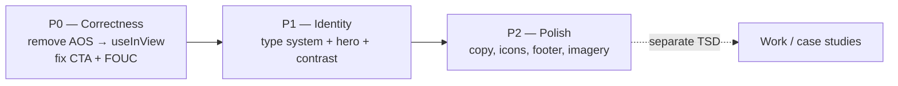

# TSD: brignano.io Visual & UX Modernization

| | |
|---|---|
| **Status** | Draft — awaiting approval |
| **Author** | Anthony Brignano |
| **Date** | 2026-06-08 |
| **Repos** | `brignano.io` (app), `aws` (DNS/email only — no app changes) |
| **Target release** | v3.0 (visual refresh) |

---

## 1. Summary

Modernize the look, feel, and copy of brignano.io so it reads as a **senior platform-engineering leader's site**, not a developer-portfolio template — while fixing a confirmed content-visibility bug. This is a **refinement, not a teardown**: structure, hosting, SEO, security headers, and the `/coding` page stay. The work is concentrated in four areas — **typography, hero, animation system, and copy/imagery**.

A larger content effort (a "Work" / case-studies section) is the highest-impact *credibility* lever but is **out of scope here** and tracked as a separate TSD (§9).

## 2. Background / problem statement

Findings from the review of the live site and source (desktop + mobile, light + dark):

1. **🔴 Home contact CTA is invisible (bug).** The final "Want to collaborate?" section renders at `opacity:0` and never recovers. AOS computes scroll offsets on init; `react-github-calendar` ([components/github-calendar-client.tsx](../components/github-calendar-client.tsx)) loads data client-side and grows the page *after* that, so the CTA's trigger lands beyond the real scroll range. `data-aos-once={true}` means it never fires. The bottom of the homepage is blank. ([app/page.tsx:324](../app/page.tsx))
2. **🟠 The type system is not wired up.** Silkscreen applies to `<h1>` via a bare element rule in `globals.css`. Section headings use `font-incognito` and the footer uses `font-inter`, **but neither font is configured** (`tailwind.config.ts` → `theme.extend: {}`, no `@theme` block). Those classes are no-ops; headings and body fall back to the default system sans. **Inconsolata is downloaded but never applied** (wasted webfont). The intended type system has drifted.
3. **🟠 Hero readability/gravitas.** The pixel Silkscreen H1 consumes the entire mobile viewport (9 lines), pushes both CTAs below the fold, and signals "indie/retro" rather than "enterprise leader." CTA buttons are low-contrast (gray-on-near-black).
4. **🟡 Low-signal content & dated decoration.** The "Highlights" strip is six buzzword boxes; the hero SVG is a generic, `aria-hidden` decoration; the footer "Built with: Next.js · Terraform · AWS" badges read junior **and** are inaccurate (Vercel hosts the app — AWS only does Route 53 DNS + SES email forwarding, per [aws/iac/main.tf](../../aws/iac/main.tf)).
5. **🟡 Theme FOUC.** Dark mode is applied in a `useEffect` after mount ([components/header.tsx:40](../components/header.tsx)), so dark-mode users get a flash of light theme on every load.

## 3. Goals / non-goals

**Goals**
- Read as a modern, senior, marketable personal site for three audiences: junior devs, senior recruiters, and CIO/CTO/CEO.
- Fix the invisible CTA and make content visibility independent of JS animation.
- Establish one intentional, performant type system.
- Tighten copy to be concise, concrete, and proof-driven.
- No regressions to SEO, structured data, CSP, or the `/coding` page.

**Non-goals (this TSD)**
- New "Work"/case-studies section and IA expansion (separate TSD, §9).
- Any change to the `aws` repo (DNS/email).
- Backend/API changes, new data sources, or a CMS.
- Re-platforming off Vercel/Next static export.

## 4. Audience & success criteria

| Audience | What they need | We win when… |
|---|---|---|
| Junior devs | "This is impressive and I can learn from it" | `/coding` + readable hero invite exploration |
| Recruiters | Fast credibility, easy contact, résumé | Hero metrics + visible CTA + 1-click résumé |
| CIO/CTO/CEO | Senior signal, scale, outcomes | Type/copy read as leadership, not hobby |

**Measurable success**
- Contact CTA visible 100% of loads (currently 0% on home).
- Lighthouse: Performance ≥ 95, Accessibility ≥ 100, no contrast failures on primary CTAs.
- No unused webfonts shipped (Inconsolata removed).
- Hero primary CTA above the fold at 375×812 (mobile).

## 5. Proposed design

### 5.1 Animation system (fixes the 🔴 bug)
- **Remove `aos`** (a 3.0.0-beta, effectively unmaintained dep) and `aos/dist/aos.css`, `components/aos-init.tsx`.
- Replace with a small `useInView` hook backed by `IntersectionObserver`. **Default rendered state is fully visible**; the fade/translate is a progressive enhancement applied only after mount + intersection.
- Respect `prefers-reduced-motion`: when set, render final state immediately, no transform.
- **Result:** content can never be hidden by a measurement race; the CTA bug disappears by construction.

### 5.2 Type system (fixes the 🟠 drift)
- Adopt **Geist Sans** as the base for headings + body (decided §10): modern, self-hosts via `next/font`, pairs with the stack, and stays memorable *because* it's paired with the Silkscreen accent rather than competing with it.
- Configure it properly via Tailwind v4 `@theme` in `globals.css` (not the vestigial JS config).
- **Keep Silkscreen as a deliberate accent only:** the `A|B` logo, `/coding` stat numbers, and small eyebrow labels. This is the site's memorable signature — concentrated, not diffuse.
- **Remove Inconsolata** and the dead `font-incognito` / `font-inter` classes; replace with real utilities.

### 5.3 Hero
- Shorten H1 to a single punchy line; move qualifiers to the subhead.
- Add a **metric strip** directly under the subhead (proof above the fold).
- **One primary (filled) CTA** + one secondary (outline); fix contrast to pass WCAG AA.
- **Imagery (decided §10):** whitespace-forward hero with a *restrained* background motif — a subtle, low-contrast line/grid suggesting a "paved road" / platform graph, anchored to the accent color. Whitespace carries the layout; the motif adds memorability without the template-y isometric cubes. Headshot is reserved for a future About/Work page, not the hero.
- Ensure the primary CTA is above the fold on mobile.

### 5.4 Copy & labels

| Where | Current | Proposed |
|---|---|---|
| Hero H1 | "I design enterprise developer platforms that help thousands of engineers ship software safely and quickly." | "I build the platforms thousands of engineers ship on." |
| Hero metrics *(new)* | — | `11,000+ repos migrated · 2023 Enterprise Tech Award · ~1.9M lines` |
| CTA | "My Resume" | "Résumé" (primary, filled) |
| CTA | "My Coding" | "Coding Activity" |
| Heading | "Contribution Graph" | "Open-source activity" |
| Highlights | 6 buzzword boxes | Best-of-both (see §5.5b) |
| Final CTA | "Want to collaborate or chat?" | "Let's build something." + 1 line + single primary button |
| `/coding` eyebrow | "... since Dec 11 2020" | "Tracked since Dec 2020" |

### 5.5b Highlights — best of both (replaces the buzzword boxes)
A two-tier block that serves execs/recruiters (proof) *and* devs (range), without two separate sections:

- **Tier 1 — Achievements (outcome + tech):** each card leads with a quantified outcome headline and carries a small row of skill pills underneath. Example: **"11,000+ repos onto one paved road"** · `GitHub Enterprise` `CI/CD` `Terraform`. ~3–4 cards drawn from real outcomes (migration, incident reduction, AI/MCP layer, the 2023 award).
- **Tier 2 — "Now" strip (personal + momentum):** a compact, low-effort line showing what you're currently building — signals you're hands-on and current. Drawn from real work: **homelab** (Proxmox/Docker/Tailscale), **local-LLM routing** (Ollama + Open WebUI), and **AI-native tooling with Claude Code**. One line each, no deep pages.

This gives the "best of both worlds" (outcomes *and* skills) and gives your homelab / Claude Code work a home **now**, cheaply — while full write-ups stay deferred to the Work TSD (§9). Source all of it from `lib/constants.ts` so it's edit-in-one-place.

### 5.5 Icons, logo, imagery
- **Keep** the `A|B` monogram (the strongest brand asset) and the dark/light favicon SVGs.
- **Standardize on `@heroicons/react`** for CTA/inline icons; remove hand-rolled `<path>` SVGs in `app/page.tsx`.
- **Footer:** drop "Built with" badges or replace with an accurate one-liner (no false AWS-hosting claim). Permanently remove the commented-out Steam link.

### 5.6 Theme FOUC
- Add a tiny **blocking inline script in `<head>`** that resolves theme from `localStorage`/`matchMedia` and sets the `dark` class before first paint. Fold the `localStorage` write into the toggle handler instead of a mount effect.

## 6. Phasing

| Phase | Scope | Risk | Reviewable as |
|---|---|---|---|
| **P0** | §5.1, §5.6 | Low | 1 PR — bug fix, no visual change intended |
| **P1** | §5.2, §5.3 | Med | 1 PR — the visible refresh |
| **P2** | §5.4, §5.5 | Low | 1 PR — copy/asset cleanup |

## 7. Risks & mitigations

| Risk | Mitigation |
|---|---|
| Removing AOS changes feel | `useInView` reproduces fade-up; verify on every page before merge |
| Static export quirks with new font loading | Use `next/font` (self-hosted, no layout shift); verify `output: export` build |
| Hero metrics become stale | Source from a single constant; note review cadence |
| Contrast regressions | Verify primary CTAs with `preview_inspect` + Lighthouse a11y before merge |
| Scope creep into "Work" section | Explicitly deferred to §9 |

## 8. Verification plan
- Local dev-server preview on `/`, `/resume`, `/coding` at desktop + mobile, light + dark.
- Assert CTA `opacity:1` and visible at page bottom (the original repro).
- Confirm `prefers-reduced-motion` shows all content with no transforms.
- Lighthouse run against targets in §4.
- `next build` (static export) succeeds; bundle size for `/coding` not increased.

## 9. Out of scope / future TSD: "Work" section
The highest-impact credibility + stickiness lever is **2–3 case studies** (11k-repo migration; AI/MCP DevOps-intelligence layer; enterprise CLI) with problem → constraints → build → measurable outcome, plus a `/work` route and IA expansion. Tracked separately because it is a content effort, not a visual refresh.

## 10. Decisions — RESOLVED
1. **Base sans font:** ✅ **Geist Sans** (modern, self-hosted via `next/font`, memorable when paired with Silkscreen accent). §5.2
2. **Hero imagery:** ✅ **Whitespace-forward + restrained "paved road" motif**; headshot reserved for future About/Work page. §5.3
3. **Accent color:** ✅ **Shift the hue** away from emerald. Candidate: an **electric indigo/violet** (modern, reads "AI/platform," breaks the matrix-terminal cliché); amber as fallback. Exact swatches (light + dark) finalized in P1 against WCAG AA. Replaces `--primary-color` greens in `globals.css`.
4. **Highlights:** ✅ **Best-of-both** — outcome cards with skill pills + a "Now" momentum strip (homelab / local-LLM / Claude Code). §5.5b
5. **"Built with" footer:** ✅ **Remove the badges** (accuracy + maturity); keep social icons + copyright.

**Projects / homelab / Claude Code:** added **now** as the lightweight "Now" strip (§5.5b); full case studies stay deferred to the Work TSD (§9).

---

*Approval = sign-off on §3 goals and §5 design (decisions in §10 are resolved). P0 can proceed immediately on approval since it carries no intended visual change.*
